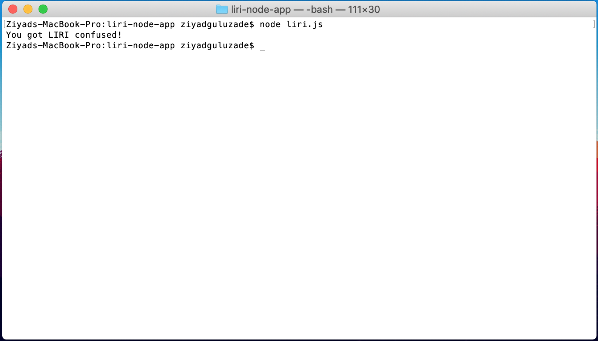
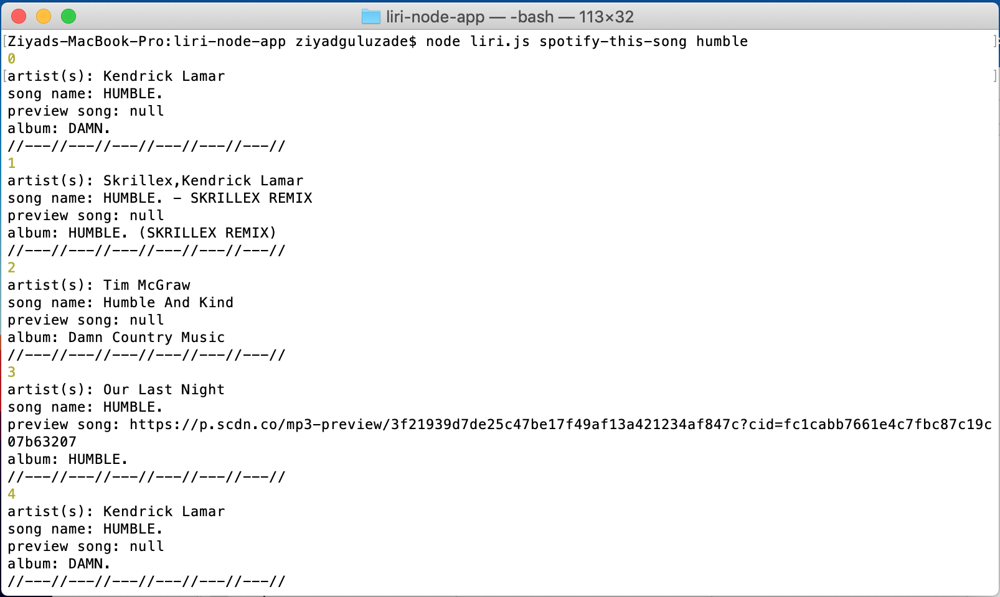

# Overview 

Liri-node-app is a back-end command line app that interacts with Spotify API. The app allows user to serach for a song and return a list of song with the matching titles that are available in Spotify.

## Views
Liri is a command line app so in order to run the app you'll need to open to command line. 

Liri-node-app ahs the initial page that says "You gor LIRI confused!".  


In order to search for a song run this in the command line: node liri.js spotify-this-song name of the song. As shown on the screenshot below Liri will return you a list of track with matching names. You can find here the name of the artist and album for every song on the list.




## Tech I used
* Javascript
* jQuery
* Node.js
* Spotify API

Fell free to copy this repo and create your own Liri-node app. 
In order to run the app locally after copying the repo follow these steps: 
* Go to the root directory
```
node liri.js spotify-this-song name of the song
```


